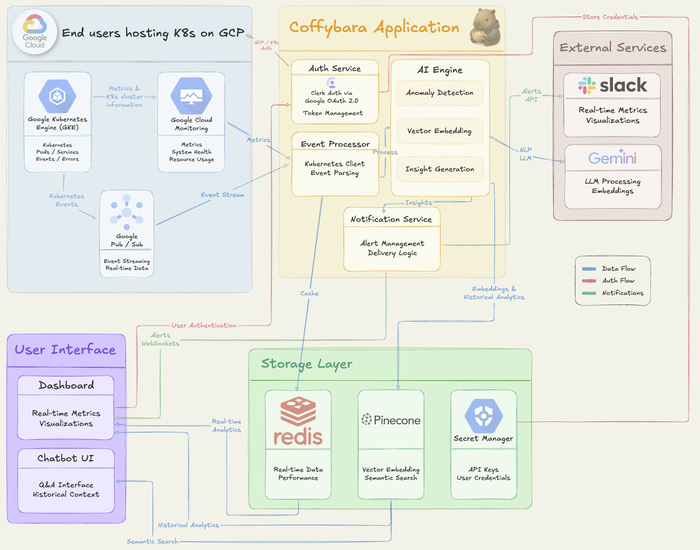

<div align='center'>

<p align="center" style="margin-bottom: 0;">
    
</p>

<h1 align="center" style="margin-top: 0;"><strong>AI-Powered Real-Time Event Detection & Kubernetes Observability</strong></h1>

[](https://github.com/oslabs-beta/capybara/releases/latest)
[](LICENSE)
[](https://github.com/oslabs-beta/capybara/actions)
[](https://github.com/oslabs-beta/capybara/commits/main)

</div><br><br><br>

<!-- Core Technologies -->

**Core Technologies**  
[](https://www.typescriptlang.org/)
[](https://nodejs.org/)
[](https://reactjs.org/)
[](https://expressjs.com/)
[](https://vitejs.dev/)

---

<!-- UI & Styling -->

**UI & Styling**  
[](https://tailwindcss.com/)
[](https://ui.shadcn.com/)
[](https://www.chartjs.org/)
[](https://daisyui.com/)

---

<!-- Infrastructure & Cloud -->

**Infrastructure & Cloud**  
[](https://cloud.google.com/)
[](https://kubernetes.io/)
[](https://www.docker.com/)
[](https://redis.io/)
[](https://vercel.com/)

---

<!-- AI & Data -->

**AI & Data**  
[](https://gemini.google.com/)
[](https://www.pinecone.io/)

---

<!-- Real-time & Communication -->

**Real-time & Communication**  
[](https://socket.io/)
[](https://slack.com/)

---

<!-- Development Tools -->

**Development Tools**  
[](https://vitest.dev/)
[](https://prettier.io/)
[](https://github.com/features/actions)

---

<!-- Authentication -->

**Authentication**  
[](https://clerk.com/)
[](https://developers.google.com/identity/protocols/oauth2)

<br><br><br>

# 🚀 What is Coffybara?

<!-- Project Status -->

[](https://coffybara.com)
[](https://linkedin.com/company/coffybara)
[](https://x.com/aicoffybara)

<!-- [](https://opensource.org/licenses/MIT) -->

Coffybara is your friendly neighborhood capybara that never sleeps, keeping watch over your Kubernetes clusters 24/7. Like a capybara lounging peacefully by the water, Coffybara maintains zen like calmness while monitoring your infrastructure chaos.

**The Problem**: Kubernetes infrastructure often leads to unexpected downtime from sneaky anomalies like resource exhaustion and pod instability.

**The Solution**: Coffybara leverages advanced AI to predict and detect these anomalies in realtime, providing immediate, actionable insights directly to your development team through Slack and an intuitive dashboard.

<br>

## ✨ Features

### 🧠 **AI-Powered Anomaly Detection**

- **Semantic Analysis**: Uses Pinecone vector database and Gemini AI for intelligent event contextualization
- **Pattern Recognition**: Learns from historical data to identify subtle anomalies before they become critical
- **Smart Insights**: Provides actionable recommendations based on similar past events

### ⚡ **Realtime Monitoring**

- **Live Event Streaming**: Kubernetes events streamed through Google Pub/Sub
- **Instant Notifications**: Realtime alerts via Socket.IO to dashboard and Slack
- **Zero Latency**: Immediate response to critical infrastructure events

### 🎯 **Smart Filtering & Deduplication**

- **Rate Limiting**: Redis-powered intelligent event throttling
- **Deduplication**: Eliminates noise from repetitive events
- **Priority Scoring**: Focuses on events that actually matter

### 📊 **Beautiful Dashboard**

- **Responsive Design**: Works seamlessly on desktop and mobile
- **Realtime Updates**: Live event feed with instant notifications
- **Historical Analytics**: Comprehensive event history and trend analysis
- **Dark/Light Mode**: Because we care about your eyes

### 🔔 **Multi-Channel Notifications**

- **Slack Integration**: Formatted alerts with context and recommendations
- **Dashboard Alerts**: Realtime notifications in the web interface
- **Severity Levels**: Color-coded alerts based on event criticality

<br>

## 🏗️ Architecture

<p align="center">
    
</p>

### **Tech Stack**

#### **Backend & Infrastructure**

- **Kubernetes** - Container orchestration
- **Google Kubernetes Engine (GKE)** - Managed Kubernetes
- **Google Cloud Monitoring** - Infrastructure monitoring
- **Google Pub/Sub** - Event streaming
- **Cloud Run** - Serverless container platform
- **Redis** - Caching and rate limiting
- **Google Secrets Manager** - Secure credential management

#### **AI & Data**

- **Pinecone** - Vector database for semantic search
- **Gemini AI API** - Intelligent event analysis
- **Vector Embeddings** - Semantic event similarity

#### **Frontend**

- **React 18** - Modern UI framework
- **TypeScript** - Typesafe development
- **Vite** - Lightning fast build tool
- **Tailwind CSS** - Utility first styling
- **ShadCN** - Beautiful component library
- **Socket.IO Client** - Realtime communication

#### **Backend API**

- **Node.js** - Runtime environment
- **Express** - Web framework
- **Socket.IO** - Realtime websockets
- **Axios** - HTTP client

#### **Authentication & Security**

- **Clerk** - OAuth 2.0 authentication
- **Google OAuth** - Secure user management

#### **DevOps & CI/CD**

- **GitHub Actions** - Automated workflows
- **Vercel** - Frontend deployment
- **Docker** - Containerization
- **Vitest** - Testing framework

<br>

## 🚀 Quick Start

### Prerequisites

- Node.js 18+
- Google Cloud Account with existing GKE cluster
- Google Cloud CLI (`gcloud`) installed and configured
- Slack workspace (for notifications)

### 1. Clone the Repository

```bash
git clone https://github.com/oslabs-beta/capybara.git
cd coffybara
```

### 2. Google Cloud Setup

Coffybara uses **Google Cloud Secrets Manager** to securely store all configuration. No local `.env` files needed!

**Enable required APIs:**

```bash
gcloud services enable secretmanager.googleapis.com
gcloud services enable pubsub.googleapis.com
gcloud services enable run.googleapis.com
gcloud services enable container.googleapis.com
```

**Create secrets in Google Cloud Secrets Manager:**

```bash
# Pinecone Configuration
gcloud secrets create pinecone-api-key --data-file=<(echo "your-pinecone-key")
gcloud secrets create pinecone-index-name --data-file=<(echo "your-index-name")

# Gemini AI
gcloud secrets create gemini-api-key --data-file=<(echo "your-gemini-key")

# Slack Integration
gcloud secrets create slack-bot-token --data-file=<(echo "your-slack-bot-token")
gcloud secrets create slack-channel --data-file=<(echo "your-channeltd")

# Redis (if using external Redis)
gcloud secrets create redis-url --data-file=<(echo "your-redis-url")

# Clerk Authentication
gcloud secrets create clerk-publishable-key --data-file=<(echo "your-clerk-key")
```

### 3. Connect to Your GKE Cluster

Coffybara automatically connects to your existing GKE clusters. Ensure your `gcloud` CLI is authenticated and has access to your clusters:

```bash
# Authenticate with Google Cloud
gcloud auth login

# Set your project
gcloud config set project YOUR_PROJECT_ID

# Get cluster credentials (if needed)
gcloud container clusters get-credentials YOUR_CLUSTER_NAME --region=YOUR_REGION
```

### 4. Start the Application

From the root directory, simply run:

```bash
npm start
```

This single command will:

- Install dependencies for root, client, and server
- Start both the client and server concurrently

**Alternative commands:**

```bash
# Start only the server
npm run server

# Start only the client
npm run client
```

### 5. Access the Application

- **Dashboard**: http://localhost:5173
- **API**: http://localhost:3001

<br>

## 🔧 Configuration

### GKE Cluster Connection

Coffybara automatically discovers and connects to your existing GKE clusters. The application will:

1. **Auto-detect** clusters in your Google Cloud project
2. **Stream events** from all accessible clusters via Google Pub/Sub
3. **Monitor** pod lifecycle, resource usage, and system events
4. **Analyze** events using AI and provide intelligent insights

**Required Permissions:**
Ensure your Google Cloud service account has these IAM roles:

- `Kubernetes Engine Viewer` (to access cluster information)
- `Pub/Sub Editor` (for event streaming)
- `Secret Manager Secret Accessor` (to read configuration secrets)

### Google Cloud Pub/Sub Setup

Create the required Pub/Sub infrastructure:

```bash
# Create Pub/Sub topic for Kubernetes events
gcloud pubsub topics create kubernetes-events

# Create subscription for event processing
gcloud pubsub subscriptions create kubernetes-events-sub --topic=kubernetes-events
```

### Slack Integration

1. Create a Slack app at https://api.slack.com/apps
2. Add the `chat:write` bot scope
3. Install the app to your workspace
4. Copy the Bot User OAuth Token to your `.env`

<br>

## 📊 Usage

### Dashboard Features

**🔴 Live Events**: Realtime stream of Kubernetes events  
**📈 Analytics**: Historical event trends and patterns  
**🎯 Filtered Views**: Focus on specific namespaces or event types  
**🔍 Search**: Find specific events quickly  
**⚙️ Settings**: Configure notification preferences

### Slack Notifications

Coffybara sends intelligent Slack notifications with:

- **Event Context**: Pod, namespace, and timing information
- **AI Analysis**: Root cause analysis and recommendations
- **Historical Context**: Similar past events for reference
- **Action Items**: Specific steps to resolve the issue

### API Endpoints

```typescript
// Get recent events
GET /api/events?limit=50&namespace=default

// Get event analytics
GET /api/analytics?timeRange=24h

// Health check
GET /api/health

// WebSocket connection
WS /socket.io
```

<br>

## 🧪 Testing

```bash
# Run all tests
npm test

# Run tests in watch mode
npm run test:watch

# Run tests with coverage
npm run test:coverage
```

<br>

## 🚀 Deployment

### Production Deployment

1. **Build the application:**

```bash
npm run build
```

2. **Deploy to Cloud Run:**

```bash
gcloud run deploy coffybara-backend \
  --source=./server \
  --platform=managed \
  --region=us-central1 \
  --allow-unauthenticated
```

3. **Deploy frontend to Vercel:**

```bash
vercel --prod
```

### Environment Variables for Production

Ensure all production environment variables are set in your deployment platform.

<br>

## 👥 Meet the Team

| Team Member      | LinkedIn                                                                                                                      | GitHub                                                                                                           |
| ---------------- | ----------------------------------------------------------------------------------------------------------------------------- | ---------------------------------------------------------------------------------------------------------------- |
| **Wenjun Song**  | [](https://www.linkedin.com/in/wsong0630/) | [](https://github.com/wsong0630)    |
| **Steven Yeung** | [](https://www.linkedin.com/in/syeungg/)   | [](https://github.com/stevenyeungg) |
| **Amit Haror**   | [](https://www.linkedin.com/in/amitharor/) | [](https://github.com/user0824)     |

<br>

## 🛣️ Roadmap

### **Next Phase**

- [ ] **Better Documentation** - Comprehensive setup guides and API documentation
- [ ] **Custom Notifications** - Alternative notification channel for critical alerts
- [ ] **Historical Analytics** - Enhanced data visualization and trend analysis
- [ ] **Custom Alert Rules** - User defined notification triggers and thresholds

### **Future Phase**

- [ ] **Multi Cluster Support** - Monitor multiple Kubernetes clusters from one dashboard
- [ ] **Resource Usage Insights** - AI powered recommendations for cluster optimization
- [ ] **Team Collaboration Features** - Comments, incident assignments, and shared workspaces

<br>

## 🤝 Contributing

We welcome contributions! Please see our [Contributing Guide](CONTRIBUTING.md) for details.

1. Fork the repository
2. Create a feature branch: `git checkout -b feature/amazing-feature`
3. Commit your changes: `git commit -m 'Add amazing feature'`
4. Push to the branch: `git push origin feature/amazing-feature`
5. Open a Pull Request

<br>

## 📋 Documentation

For developers and maintainers:

- **[📋 Release Process](RELEASE_PROCESS.md)** - Step-by-step guide for creating new releases
- **[📝 Changelog](CHANGELOG.md)** - Version history and release notes
- **[🤝 Contributing Guide](CONTRIBUTING.md)** - How to contribute to the project

<br>

## 📝 License

This project is licensed under the MIT License - see the [LICENSE](LICENSE) file for details.

<br>

## 🙏 Acknowledgments

- **Capybaras** for being the most chill animals and inspiring our mascot
- **Google Cloud** for providing robust infrastructure
- **The Kubernetes Community** for amazing orchestration tools
- **Google** for powerful AI capabilities

<br>

## 🐞 Issues & Support

Found a bug? Have a feature request? We'd love to hear from you!

- **Issues**: [GitHub Issues](https://github.com/oslabs-beta/capybara/issues)
- **Discussions**: [GitHub Discussions](https://github.com/oslabs-beta/capybara/discussions)

<br><br>

<div align="center">

_Keep your clusters happy, keep your capybaras caffeinated!_

</div>
