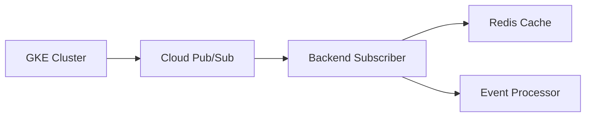
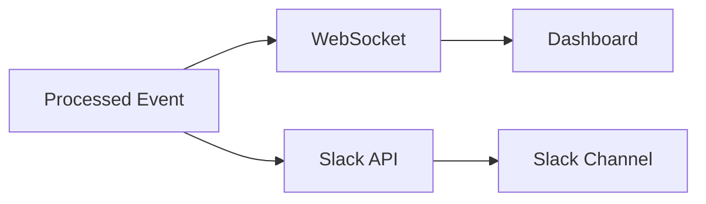

# 🏗️ Architecture Overview

This document provides a comprehensive overview of Coffybara's system architecture, design decisions, and technical implementation.

## System Architecture

    

Coffybara follows a **microservices architecture** with real-time event processing and AI powered analysis capabilities.

## Core Components

### 1. Event Collection Layer

**Google Kubernetes Engine (GKE)**

- Source of all Kubernetes events
- Monitors pod lifecycle, resource usage, and system events
- Streams events to Google Pub/Sub in real-time

**Google Cloud Pub/Sub**

- Acts as the event streaming backbone
- Decouples event production from consumption
- Provides reliable, scalable message delivery
- Handles event ordering and delivery guarantees

### 2. Event Processing Layer

**Node.js Backend (Express)**

- Consumes events from Pub/Sub subscriptions
- Implements intelligent filtering and deduplication
- Coordinates AI analysis and notification workflows
- Provides REST API for frontend communication

**Redis Cache**

- Implements rate limiting for event processing
- Caches frequently accessed data
- Provides session storage for real-time connections
- Prevents duplicate event processing

### 3. AI Analysis Layer

**Pinecone Vector Database**

- Stores vector embeddings of historical events
- Enables semantic similarity search
- Provides context for AI analysis
- Scales automatically with data volume

**Google Gemini AI**

- Generates embeddings for event vectorization
- Performs natural language analysis of events
- Provides intelligent recommendations
- Contextualizes events with historical data

### 4. Notification Layer

**Slack Integration**

- Delivers formatted alerts to development teams
- Provides contextual information and recommendations
- Supports rich message formatting
- Enables team collaboration on incidents

**WebSocket (Socket.IO)**

- Provides real-time updates to dashboard
- Maintains persistent connections with clients
- Broadcasts events to multiple connected users
- Enables real-time collaboration features

### 5. User Interface Layer

**React Frontend**

- Modern, responsive web application
- Real-time event dashboard with live updates
- Historical analytics and trend visualization
- User authentication and authorization

**Clerk Authentication**

- OAuth 2.0 integration with Google
- Secure user session management
- Role-based access control
- SSO capabilities for enterprise users

## Data Flow

### 1. Event Ingestion

1. **GKE clusters** generate Kubernetes events
2. **Cloud Pub/Sub** receives and queues events
3. **Backend service** subscribes to events
4. **Redis** provides deduplication and rate limiting
5. **Event processor** validates and enriches events

### 2. AI Analysis Pipeline

1. **Events** are sent to Gemini AI for embedding generation
2. **Vector embeddings** are stored in Pinecone
3. **Similarity search** finds related historical events
4. **AI analysis** provides context and recommendations
5. **Results** are formatted for notifications

### 3. Real-time Distribution

1. **Processed events** are distributed via multiple channels
2. **WebSocket** delivers real-time updates to dashboard
3. **Slack API** sends formatted notifications
4. **Users** receive immediate alerts

## Technology Stack Deep Dive

### Backend Technologies

**Node.js + TypeScript**

- **Why**: Type safety, excellent async handling, rich ecosystem
- **Benefits**: Reduced runtime errors, better IDE support, maintainable code
- **Alternatives considered**: Python (FastAPI), Go

**Express.js**

- **Why**: Lightweight, flexible, extensive middleware ecosystem
- **Benefits**: Fast development, great community support
- **Usage**: REST API endpoints, middleware for auth, logging, CORS

**Socket.IO**

- **Why**: Reliable WebSocket implementation with fallbacks
- **Benefits**: Real-time bidirectional communication, automatic reconnection
- **Usage**: Live dashboard updates, real-time notifications

### Frontend Technologies

**React 18**

- **Why**: Component-based architecture, excellent ecosystem, performance
- **Benefits**: Reusable components, strong TypeScript support, active community
- **Features used**: Hooks, Context API, Suspense

**TypeScript**

- **Why**: Type safety, better development experience, reduced bugs
- **Benefits**: Compile time error checking, excellent IDE support
- **Configuration**: Strict mode enabled, path mapping configured

**Vite**

- **Why**: Lightning-fast development server, optimized builds
- **Benefits**: HMR (Hot Module Replacement), ES modules support, fast builds
- **Alternatives considered**: Create React App, Webpack

**Tailwind CSS + ShadCN/UI**

- **Why**: Utility-first CSS, consistent design system
- **Benefits**: Rapid prototyping, maintainable styles, responsive design
